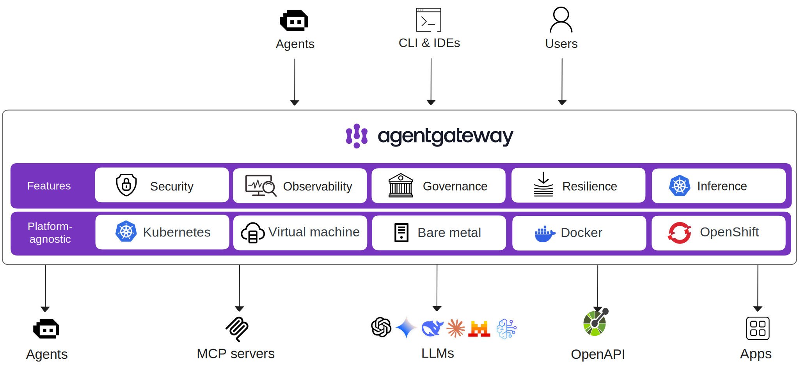

  <picture>
    <source media="(prefers-color-scheme: dark)" srcset="https://raw.githubusercontent.com/agentgateway/agentgateway/refs/heads/main/img/banner-light.svg" alt="agentgateway" width="400">
    <source media="(prefers-color-scheme: light)" srcset="https://raw.githubusercontent.com/agentgateway/agentgateway/refs/heads/main/img/banner-dark.svg" alt="agentgateway" width="400">
    
  </picture>
  

    
    
    
    
    
    
  

  

    The <strong>first complete</strong> connectivity solution for Agentic AI.
  

---

**Agentgateway** is an open source proxy built on AI-native protocols ([MCP](https://modelcontextprotocol.io/introduction) & [A2A](https://developers.googleblog.com/en/a2a-a-new-era-of-agent-interoperability/)) that provides drop-in security, observability, and governance for agent-to-LLM, agent-to-tool, and agent-to-agent communication across any framework and environment.

  

  

 

## Intro to Agentgateway Video

## Key Features

- **LLM Gateway** 
  Route traffic to major LLM providers (OpenAI, Anthropic, Gemini, Bedrock, and more) through a unified OpenAI-compatible API with budget and spend controls, prompt enrichment, load balancing, and failover.

- **MCP Gateway** 
  Connect LLMs to tools and external data sources via MCP with tool federation, stdio/HTTP/SSE/Streamable HTTP transports, OpenAPI integration, and OAuth authentication.

- **A2A Gateway** 
  Enable secure agent-to-agent communication using A2A, with capability discovery, modality negotiation, and task collaboration.

- **Inference Routing** 
  Intelligent routing to self-hosted models using Kubernetes Inference Gateway extensions, with decisions based on GPU utilization, KV cache, LoRA adapters, and queue depth.

- **Guardrails** 
  Multi-layered content filtering with regex, OpenAI moderation, AWS Bedrock Guardrails, Google Model Armor, and custom webhooks.

- **Security & Observability** 
  Auth (JWT, API keys, OAuth), fine-grained RBAC with CEL policy engine, rate limiting, TLS, and OpenTelemetry metrics/logs/tracing.
 

## Getting Started

- [Standalone Quickstart](https://agentgateway.dev/docs/quickstart) — Get started with agentgateway in minutes.
- [Kubernetes Quickstart](https://agentgateway.dev/docs/kubernetes/latest) — Deploy on Kubernetes using the built-in controller and Gateway API.

## Documentation

Depending on your deployment environment, check out the following docs:

- [agentgateway.dev/docs](https://agentgateway.dev/docs/): For standalone deployments such as local or on-prem. These docs are for this upstream `agentgateway/agentgateway` GitHub project.
- [agentgateway.dev/docs/kubernetes/latest](https://agentgateway.dev/docs/kubernetes/latest): For Kubernetes-based deployments using the built-in Kubernetes controller and Gateway API support.

Agentgateway has a built-in UI for you to explore agentgateway connecting agent-to-agent or agent-to-tool:

  

## Contributing

For instructions on how to contribute to the agentgateway project, see the [CONTRIBUTION.md](CONTRIBUTION.md) file.

## Community Meetings
To join a community meeting, add the [agentgateway calendar](https://calendar.google.com/calendar/u/0?cid=Y18zZTAzNGE0OTFiMGUyYzU2OWI1Y2ZlOWNmOWM4NjYyZTljNTNjYzVlOTdmMjdkY2I5ZTZmNmM5ZDZhYzRkM2ZmQGdyb3VwLmNhbGVuZGFyLmdvb2dsZS5jb20) to your Google account. Then, you can find event details on the calendar.

Recordings of the community meetings will be published on our [google drive](https://drive.google.com/drive/folders/138716fESpxLkbd_KkGrUHa6TD7OA2tHs?usp=sharing).

## Roadmap

`agentgateway` is currently in active development. If you'd like a feature that's missing, open an issue in our [GitHub repo](https://github.com/agentgateway/agentgateway/issues).

## Contributors

Thanks to all contributors who are helping to make agentgateway better.

### Star History

<a href="https://www.star-history.com/#agentgateway/agentgateway&Date">
 <picture>
   <source media="(prefers-color-scheme: dark)" srcset="https://api.star-history.com/svg?repos=agentgateway/agentgateway&type=Date&theme=dark" />
   <source media="(prefers-color-scheme: light)" srcset="https://api.star-history.com/svg?repos=agentgateway/agentgateway&type=Date" />
   
 </picture>
</a>

---

    
    
Agentgateway is a <a href="https://www.linuxfoundation.org/">Linux Foundation</a> project.

